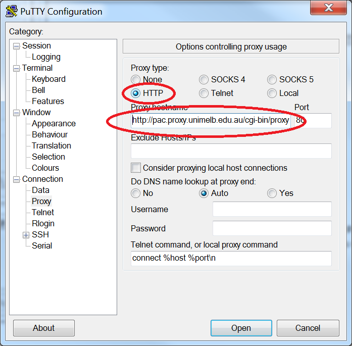

Workshop - Infrastructure
=========================

This workshop introduces students to infrastructure concepts that underpin the use of the Internet for informatics and data processing. Specifically we will be looking at the Hypertext Transfer Protocol (HTTP), Common Gateway Interface (CGI) and briefly Hypertext Markup Language (HTML). These three areas are fundamental to understanding the mechanics of information transfer across networks, and are therefore an essential platform to building knowledge in informatics.

The structure of the workshop will be a slide presentation on each area, followed by a series of guided questions for you to work through and understand the basic concept. The answers to these will be covered within the workshop. This will be followed by a set of exercises that are for you to complete at the end of the workshop and in your own time to develop your understanding and prepare for the final exam. Answers to these questions will be made available a week after the workshop.

A. Hyper-Text Transfer Protocol (HTTP)
-----------------------------------
Presentation: slides 1 to 10.

Open up Putty (Windows button then put “putty” into the search box).
Configure the screen as shown in figure 1.

Figure 1: the configuration screen for Putty. Put in the hostname “www.unimelb.edu.au”,port “80”, connection type “Raw”, Close window on exit “Never”.

Open notepad and write the following HTTP request information as shown in figure 2.

Figure 2: HTTP text to copy into the Putty window

As the webpage returned will likely be large, you may need to set the scrollable size by editing the Lines of Scrollback to “20000” under the Window section, as shown in figure 3.

Figure 3: configuring the scroll size of the Putty window

**Question 1**

Open a terminal using Putty as described above and connect to www.unimelb.edu.au by copying and pasting the commands from Notepad into the terminal window. Look at the output that is returned.

1. Where does the response information start?
2. What server engine is hosting this site?
3. What HTTP code has been returned?
4. Try again with the input “GET /test.html HTTP/1.1” on the first line. What code is returned?

**Question 2**

Now connect to www.google.com. To do this, follow the instructions as for question 1, but will also need to set the proxy for the University network in Putty as shown in figure 4.

Figure 4: in the Proxy section of Putty, select “HTTP” for the Proxy type and for the Proxy hostname put in `http://pac.proxy.unimelb.edu.au/cgi-bin/proxy.pac`.

1. What HTTP code has been returned this time?
2. What does this tell you about the website?

**Question 3**

Compare the output from the Putty terminal and the output of the web-page in a browser. How do they differ? We’re about to demonstrate how information is passed between one page and another – if you can’t see it, do you think the information is hidden/protected?

B. Hyper-Text Mark-up Language (HTML)
----------------------------------
Presentation: slides 11 and 12.

Note that this is a *very* brief discussion about HTML just to understand what is being communicated across the network using HTTP. The details of mark-up languages will be covered in week 4.

Open up a browser and navigate to this page `http://[server]/form_example.html`. Click on “View” then “Source” (or ctrl-U as the keyboard shortcut) and look at the output returned.

**Question 1**

1. What tags can you see?
2. Do you know what these represent?

**Question 2**

Now go to www.amazon.com. Again, view the page source and look at the output. What is different about this page?

C. Common Gateway Interface (CGI)
------------------------------
Presentation: slides 13 to 29

**Question 1**

Serve the following python script `http://[server]/env.py` (or navigate to it through a browser) and look at the output.

1. What is the server’s IP address?
2. What is the server application that is running (e.g. Apache, Tomcat?) and what version?
3. Which variable tells you information about the browser that *you* are connecting with (as the client)?

**Question 2**

Serve the same script again. But this time add the following parameters by inputting them through the URI:

- `name = blofeld`
- `mission = destroy+world`

1. What is the full string that you add to the URI?
2. Which variable does this information appear in?

**Question 3**

Now serve this page again `http://[server]/form_example.html`, put a text or number value in the box and click “submit”.

1. Which variable does this information appear in?
2. What is the name of the variable and where is this set in the requesting form?

**Question 4**

Finally, serve this page `http://[server]/fieldstore.py` and add the parameters in the URI as in question 2.

1. What does the output look like?
2. Look at the way the python script prints the output – what is the advantage of formatting data like this?

Exercises
---------

1. HTTP is a stateless protocol, by which we mean that it has no memory of one transaction to the next.

  1. Create an HTML form to submit some parameters to another page (you can use slide 13 as a template or look up `http://www.w3schools.com` for help).
  2. Pass a parameter to a CGI script, which you will write using Python, using the `<input type="hidden">` tag.
  3. The CGI script will output HTML displaying the value of all the parameters that you've passed through, including the hidden ones.
  4. Now, in the HTML page that has been output, add another form.
  5. Pass one of the parameters into this new form and repeat the process to pass the information to a new CGI script and HTML output (creating a chain).
  6. Briefly sketch in a block diagram the sequence of HTML form, CGI scripts and parameters passed between them.

   Can you see how this process allows one page to *remember* another and pass information down a chain of HTTP requests? Can you think of another way for pages to remember the conversation from one HTTP conversation to the next (hint: think about persistent data and text files).

2. As demonstrated above, you can display environment variables on a server by invoking a form, and these provide information about the client (e.g. `HTTP_USER_AGENT`). You can manipulate these client variables by changing the lines on your HTTP request (the commands starting with `GET…` in question 1 under HTTP). Write an HTTP request that includes information on the `HTTP_USER_AGENT` and the `HTTP_REFERER` (an environment variable that represents where the CGI script has been called from). As the client, can you control what the server displays for these variables? What are the security implications of this?

3. Consider a scenario where you have a large number of calculations and a large resulting data-set. In many web-enabled informatics processes you must communicate such calculations and data between pages using HTTP and CGI, but their size makes this communication difficult.

  1. Using this `data-set`, write a CGI script that reads in the CSV file and outputs the data to an HTML table. How long does it take to render?

  2. Instead of reading one line at a time, trying reading several at a time.  
    1. Is there an optimum size of line numbers?
    2. Is there an overhead in finding the place in the data-set again?

  3. Is the way the information organised important? Why?

  4. Is there a way to manage the user experience that helps with the processing time?
    1. Is there a way to process the data in the background?

For references to help, try `https://docs.python.org/2/library/csv.html` for handling CSV files in Python and `http://www.w3schools.com` for HTML table tags.

Other Resources
---------------

- **Telnet** (http://www.telnet.org) – this is one of the original network protocols. Now superceded by other technologies it can still provide a useful insight into the structure of the detail of conversations across the internet. Most operating systems have a version of the Telnet application that is disabled by default, but can be re-enabled by installing the relevant package (Linux and later Mac versions) or setting the service through Control Panel options (Windows). Beware if you do enable it as it is unencrypted and has a variety of security issues (hence why it’s disabled by default).

- **cURL** (http://curl.haxx.se/) – a lightweight software project that allows data transfer through URIs. Using the libcurl library it supports the most common internet protocols (HTTP, FTP, telnet, etc) and allows you to send or receive files from the command line. Limited in usefulness it still shows the detail of HTTP headers as discussed in this workshop.

- **WireShark** (https://www.wireshark.org) – this is a full-on (and award-winning) packet analyser. It gives detailed information on network connectivity to your computer and it’s relation to the wider Internet. Very useful in troubleshooting network issues and seeing exactly what your computer’s surrounding environment looks like.
