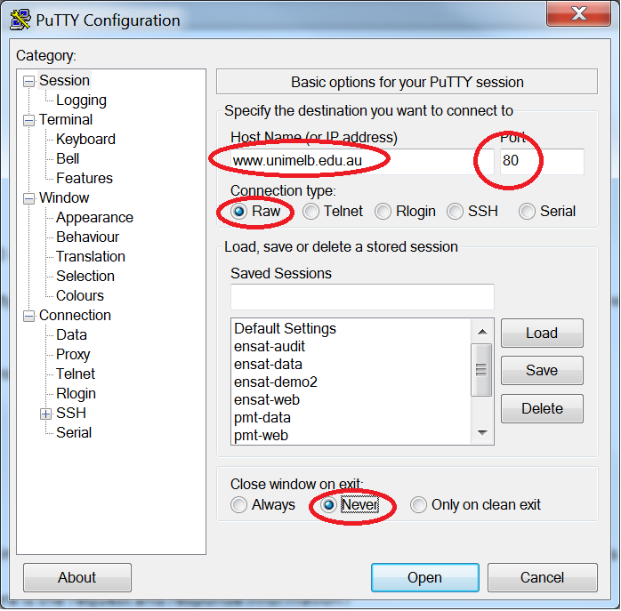
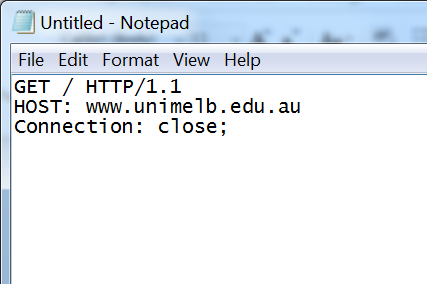
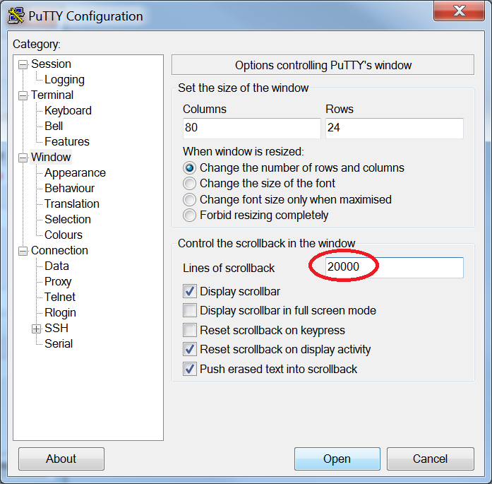

Workshop - Infrastructure
=========================

This workshop introduces students to infrastructure concepts that underpin the use of the Internet for informatics and data processing. Specifically we will be looking at the Hypertext Transfer Protocol (HTTP), Web Application Framework (using Flask) and briefly Hypertext Markup Language (HTML). These three areas are fundamental to understanding the mechanics of information transfer across networks, and are therefore an essential platform to building knowledge in informatics.

The structure of the workshop will be a slide presentation on each area, followed by a series of guided questions for you to work through and understand the basic concept. The answers to these will be covered within the workshop. This will be followed by a set of exercises that are for you to complete at the end of the workshop and in your own time to develop your understanding and prepare for the final exam. Answers to these questions will be made available a week after the workshop.

<a target="_blank" href="infrastructure.ppt" file="ppt"> Slides used for this workshop</a>

A. Hyper-Text Transfer Protocol (HTTP)
-----------------------------------
Presentation: slides 1 to 10.

Open up Putty (Windows button then put “putty” into the search box).
Configure the screen as shown in figure 1.

*Figure 1*: the configuration screen for Putty. Put in the hostname “www.unimelb.edu.au”,port “80”, connection type “Raw”, Close window on exit “Never”.

Open notepad and write the following HTTP request information as shown in figure 2.

*Figure 2*: HTTP text to copy into the Putty window

As the webpage returned will likely be large, you may need to set the scrollable size by editing the Lines of Scrollback to “20000” under the Window section, as shown in figure 3.

*Figure 3*: configuring the scroll size of the Putty window

**Question 1**

Open a terminal using Putty as described above and connect to www.unimelb.edu.au by copying and pasting the commands from Notepad into the terminal window and pressing return twice. Look at the output that is returned.

1. Where does the response information start?
2. What server engine is hosting this site?
3. What HTTP code has been returned?
4. Try again with the input “GET /test.html HTTP/1.1” on the first line. What code is returned this time?

**Question 2**

Compare the output from the Putty terminal and the output of the web-page in a browser. How do they differ? We’re about to demonstrate how information is passed between one page and another – if you can’t see it, do you think the information is hidden/protected?

**Question 3 (only works on UniWireless connection)**

Now connect to www.google.com in the same way.

1. What HTTP code has been returned this time?
2. What does this tell you about the website?

Creating Web App
---------------------

Follow the following recipe, to create a simple web application using Flask. First,
create a file called `app.py` that contains the following code:

    from flask import Flask
    app = Flask(__name__, static_folder='.', static_url_path='')

    @app.route("/")
    def main():
        return 'Hello World'

    if __name__ == "__main__":
        app.run(debug=True)

Run the application using the following command:

    C:\Documents> python app.py

If there is an issue, you may want to use the complete path for the python program:

    C:\Documents> C:\Users\username\AppData\Local\Continuum\Anaconda2\python app.py

You should see something like:

    * Running on http://127.0.0.1:5000/ (Press CTRL+C to quit)
    * Restarting with stat
    * Debugger is active!

Launch a browser and put http://127.0.0.1:5000/ in the addrress bar.

#### Exercise:

B. Hyper-Text Mark-up Language (HTML)
----------------------------------
Presentation: slides 11 and 12.

Note that this is a *very* brief discussion about HTML just to understand what is being communicated across the network using HTTP. The details of mark-up languages will be covered in week 4.

\\{div class="exercise"

#### Exercise 4

Write a Python script that rewrites the data inside `book.xml` as a web page (HTML). Use an HTML table to format the data. See the following example below.

<table border="0" cellpadding="5" cellspacing="1">
<tr bgcolor="#CCCC99"><td><b>Author</b></td><td><b>Salinger, J. D.</b></td></tr>
<tr bgcolor="#CCCC99"><td><b>Title</b></td><td><b>The Catcher in the Rye</b></td></tr>
<tr bgcolor="#CCCC99"><td>Language</td><td>English</td></tr>
<tr bgcolor="#CCCC99"><td>Publish date</td><td>1951-07-16</td></tr>
<tr bgcolor="#CCCC99"><td>Publisher</td><td>Little, Brown and Company</td></tr>
<tr bgcolor="#CCCC99"><td>Isbn</td><td>0-316-76953-3</td></tr>
<tr bgcolor="#CCCC99"><td>Description</td><td>A story about a few important days in the life of Holden Caulfield</td></tr>
</table>

*Tips and Hints:*
To produce an HTML page using Python, see the example below. The script displays current temperature in New York.

    from lxml import etree
    from urllib import urlopen

    # Get the XML data of the current weather at Central Park, New York
    xmltree = etree.parse(urlopen("http://w1.weather.gov/xml/current_obs/KNYC.xml"))
    root = xmltree.getroot()
    location = root.find('location').text
    temp = root.find('temperature_string').text

    # Display the location and temperature in HTML
    f = open('output.html', 'w')
    f.write('<html><body>')
    f.write('
Current temperature at %s is %s
' % (location, temp))
    f.write('</body></html>')
    f.close()

\\}

Open up a browser and navigate to this page [form example](http://students.informatics.unimelb.edu.au/~astell/foi/mywork/infrastructure_workshop_week2/scripts/form_example.html). Click on “View” then “Source” (or ctrl-U as the keyboard shortcut) and look at the output returned.

**Question 1**

1. What tags can you see?
2. Do you know what these represent?

**Question 2**

Now go to www.amazon.com. Again, view the page source and look at the output. What is different about this page?

Exercise (Optional)
---------

a) Consider a scenario where you have a large number of calculations and a large resulting data-set. In many web-enabled informatics processes you must communicate such calculations and data between pages using HTTP, HTML and CGI, but their size makes this communication difficult.

  1. Using this [data-set](assets/data.csv), write a script that reads in the CSV file and outputs the data to an HTML table, using Flask.

  2. How long does it take to render? (Note: you may want to use the `time.clock()` Python library and function for this)

  3. Is the way the information organised in the data important for the data processing time? What would be the impact if the lines in the data-set were of differing length?

  4. Consider the user experience of viewing this data. If the data takes a long time to render, can you think of a way to process some information in the background whilst presenting initial results? Add this solution to your code (hint: think about breaking the data up into pages).

  5. When breaking up the data processing in the question above, is there an overhead in finding the last processing place in the data-set again?

  For references to help, try the [Python CSV library](https://docs.python.org/2/library/csv.html) for handling CSV files in Python and [w3schools](http://www.w3schools.com) for HTML tags.

Other Resources
---------------

- **Telnet** (http://www.telnet.org) – this is one of the original network protocols. Now superceded by other technologies it can still provide a useful insight into the structure of the detail of conversations across the internet. Most operating systems have a version of the Telnet application that is disabled by default, but can be re-enabled by installing the relevant package (Linux and later Mac versions) or setting the service through Control Panel options (Windows). Beware if you do enable it as it is unencrypted and has a variety of security issues (hence why it’s disabled by default).

- **cURL** (http://curl.haxx.se/) – a lightweight software project that allows data transfer through URIs. Using the libcurl library it supports the most common internet protocols (HTTP, FTP, telnet, etc) and allows you to send or receive files from the command line. Limited in usefulness it still shows the detail of HTTP headers as discussed in this workshop.

- **WireShark** (https://www.wireshark.org) – this is a full-on (and award-winning) packet analyser. It gives detailed information on network connectivity to your computer and it’s relation to the wider Internet. Very useful in troubleshooting network issues and seeing exactly what your computer’s surrounding environment looks like.

- All scripts in these exercises are available from [this IVLE zip file](http://students.informatics.unimelb.edu.au/~astell/foi/mywork/infrastructure_workshop_week2/scripts/week2_scripts.zip).

Readings
--------

- **The Cuckoo's Egg**, Cliff Stoll (2005) - a fascinating read about one of the earliest hackers of the Internet, being tracked and hunted by a pioneer of Internet technology in California. A highly readable computer crime story, it also gives great insight into how the protocols of the Internet (such as HTTP) were developed and used back in the 80's.