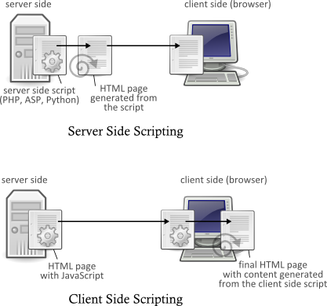

Workshop - Interactive Web Applications using JavaScript
========================================

JavaScript is one of the technologies most commonly used to develop [Rich Internet Applications](https://en.wikipedia.org/wiki/Rich_Internet_application). It allows business logic to be develop in a client-side (browser-based) through scripting capability. Consequently, this provides more engaging and interactive web pages.

On the other hand, server-side scripting frameworks--such as ASP, PHP, and Python--generate HTML codes in the server-side and the generated HTML statically constructs the web page that you see in the browser. Subsequently, the server can not directly change the content of the web page (see the figure below).

With a client side scripting, parts of your HTML content/codes can be changed on-the-fly while the page is being viewed in the browser. The changes can be triggered by user input or by the incoming data from the server.

\\{div class="exercise"

#### Exercise

To demonstrate the distinction between the client-side and the server-side scripting, download and unzip the <a href="assets/helloworld.zip">two versions of Hello World applications on a local folder</a>. These applications simply print out three lines of "Hello World". Run the application using the following command:

    c:\helloworld>python helloworld.py

Inn your browser, launch the following URL to see how the HTML content is generated in ther server-side:

    http://localhost:8765/helloworld

and this url for content generation in the client-side:

    http://localhost:8765/helloworld.html

Inspect the source code of those two pages and the differences. Research and discuss the advantages/disadvantages of these two approaches.

\\}

\\{div class="exercise"

#### Tips:

Read through the [w3schools JavaScript Basic Tutorial](http://www.w3schools.com/js/default.asp) to familiar yourself with the basic programming constructs of the language (iteration, conditionals, etc.)

\\}

Using jQuery for rapid JavaScript development.
---------------------------------------------

In this workshop you will learn how to use a JavaScript library called [jQuery](http://jquery.com). jQuery hides a lot of the complexities of JavaScript in dealing with the ordinary way of manipulating HTML codes; it provides a simple way to put logic and computational capabilities to your page without writing too much codes.

Document Object Model (DOM) Manipulation.
---------------------------------------------

A web page is constructed from a collection of HTML elements organised in a tree structure (similar to an XML file). The way these elements are organised can be viewed using [Document Object Model](http://www.w3schools.com/dom/default.asp) (DOM). Using DOM, we can access all elements within the page and manipulate the elements of interest.

Download [dom.zip](assets/dom.zip) and extract it to your desktop.

Inspect `dom-0.html` and `dom.css`. Familiar yourself with how the HTML page is structured and how CSS is used to format the page (revisit the HTML &amp; CSS lectures, if required). You shall notice that JavaScript code is enclosed within `

`window.onload = initContent` means that once the page is loaded, `initContent` function will be called. This function simply uses `document.getElementById` to get hold of the `content` element and insert HTML code inside the element (Note that `document` is a predefined global variable that represent the whole DOM (similar to `lxml`'s `tree`). This is how DOM access and manipulation are carried out using pure JavaScript, without jQuery.

Now, we can use jQuery library to make DOM manipulation easier. To do that you first need to include jQuery library. See how this can be done in `dom-1.html`:

    

The two lines in `dom-0.html`:

    var content = document.getElementById("content");
    content.innerHTML = "<h1>Hello World from JavaScript</h1>";

can now be replaced with a more succinct:

    $('#content').html("<h1>Hello World from jQuery</h1>");

And:

    window.onload = initContent;

is now replaced with:

    $(document).ready(initContent);

With jQuery you can also manipulate the look and feel of the element using CSS styles:

    // now add a bit of color
  	attributes = { "font-family" : "Verdana", "color": "#ff9900" };
	  $('#content h1').css(attributes);

Notice that with jQuery you can use various CSS selectors to select a set of element(s). It means that you can update multiple elements at the same time. See how this is done in `dom-2.html` to format multiple paragraphs (`
`).

\\{div class="exercise"

#### Exercise

Load `dom-2.html` in your browser and look at the HTML generated by the Javascript code. You can do this is Chrome by right-clicking the page and select **Inspect** from the context menu.

\\}

Event Driven Programming
------------------------

Programming using JavaScript usually involves a programming paradigm called [Event Driven Programming](http://en.wikipedia.org/wiki/Event-driven_programming). Instead of linear execution of codes, event driven programming relies on [events](http://api.jquery.com/category/events/) and their handlers. Each element in an HTML page is associated to a specific set of events. For example, a hyperlink can have [hover](http://api.jquery.com/hover/) event and [click](http://api.jquery.com/click/) event. You can assign a function, a handler, that should be called when the an event occurs.

With jQuery specifying a handler for an event is easy:

    $(selector).click(function_that_handle_the_click_event);

Download [event.zip](assets/event.zip) and extract it to your desktop.
Open `event-0.html` and see that two buttons are added in the footer:

    <input id="show_button" type="button" value="Show Content" />
    <input id="hide_button" type="button" value="Hide Content" />

We can set that a function should be called when a button is click:

    function showContent() { $('#content').show('slow'); }
    function hideContent() { $('#content').hide('slow'); }
    ...
    $('#show_button').click(showContent);
    $('#hide_button').click(hideContent);

Notice that clicking the first button will display the content block and the second one will hide the same element. Often, we can avoid having an explicit function definition, and instead, defining the function directly in the set up of the event handler. Look at `event-1.html`:

    $('#show_button').click(
      function(){
        $('#content').show('slow');
      }
    );

\\{div class="exercise"

#### Exercise

With the given example, play around with different events (like hover) and different [effects](http://api.jquery.com/category/effects/) (like [fadeIn](http://api.jquery.com/fadeIn/)).

\\}

\\{div class="exercise"

#### Exercise

Download [`jquery-demo.zip`](assets/jquery-demo.zip), load the `gen-table.html` in your browser, and observe the behaviour of this simple application. Without looking at the underlying code, try to recreate the page.

\\}

Ajax (Asynchronous JavaScript and XML)
--------------------------------

One of the most compelling use of JavaScript is to get data from a server (or other data sources) and to update certain parts of web page using the data updates. This is called Ajax technique, which allows us to build interactive web page without repeatedly reloading the web page. It means users can can have a smoother experience in interacting with the content on the page.

This technique is initiated with the JavaScript codes making an Ajax call to a server (similar to the way you `POST/GET` data using HTML form, but without reloading the page). The server will response with the requested data in XML format (nowadays, JSON format is used more widely). Upon receiving the data, which is an event in itself, the JavaScript will call an event handler. The event handler can then carry out the further steps with the data such as displaying the data on the page.

Download [`ajax-xml.zip`](assets/ajax-xml.zip) and unzip to a local directory. This package demonstrates a simple calculator using Ajax call in jQuery. This application takes a user input, a mathematical expression (in Python), send it to the server via Ajax in JSON format. The server evaluates the expression and returns the result in XML format back to the client (JavaScript). Run the application from your local directory using the following command:

    c:\ajax>python ajax-xml.py

Inn your browser, launch the application:

    http://localhost:8765/ajax.html

Write a mathematical expression in the input box. Clicking the button will send the expression (data) as part of the Ajax call to a Python script (ajax.py). The result of the expression is returned back by the Python script as XML data. The success event handler will then display the result in the textarea on page.

The minimum skeleton for an Ajax call is as the following:

    $.ajax( {
      type        : "POST",
      url         : "ajax.py",      // server script
      data        : request_data,   // data input to server
      contentType : requestType,
      dataType    : responseType,   // server will return data in either json or xml
      success     : function(responseData) {  // success event handler
        // handling the response here
      }
    });

\\{div class="exercise"

#### Exercise

In the Ajax call inside `ajax.html`, you can see that `contentType` is set to `application/json` as the format/type of the request. This value is called [MIME type](https://www.iana.org/assignments/media-types/media-types.xhtml). You can use other type/format of request, like `text/xml` or `text/plain`. The `dataType` in the same call indicates how the data should be returned ('xml' or 'json'). jQuery will use `dataType` to smartly process the `responseData`.

Inspect the `ajax.py` to see how the Ajax response is constructed.

Now, Modify the application to provide an option to the user for selecting the format of the Ajax response (either as XML or JSON). You need to add a radio button `ajax.html` for format selection. Modify `ajax.py` to include response generation in JSON format.

\\}

Other Resources
---------------

- Douglas Crockford (2008). [Javascript: the good parts](http://www.amazon.com/JavaScript-Good-Parts-Douglas-Crockford/dp/0596517742/ref=sr_1_1?ie=UTF8&qid=1425589713&sr=8-1&keywords=javascript+the+good+parts) - Even though this is a reference book, Crockford is a very engaging writer and it is quite thin so is readable from cover-to-cover. I recommend trying to do this or dipping in to read a couple of chapters at random - if you're even just slightly interested in Javascript and JSON it is well worth it.
