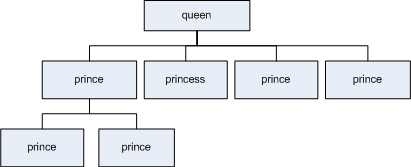

Workshop - eXtensible Markup Language (XML)
=====================

The JSON workshop allows students to explore XML as a method of representing, validating and exchanging data. You are going to learn `lxml` package, a Python library that can be used to handle XML data.

 **A piece of code preceded with `>>>` needs to be executed in Python Console.**

\\{div class="exercise"

#### Exercise 1

Type in (or copy and paste) the following XML data using the IVLE text editor.

    <?xml version="1.0" encoding="utf-8"?>
    <queen title="Queen Elizabeth II" marriedTo="Philip, Duke of Edinburgh">
        <prince title="Charles, Prince of Wales" marriedTo="Lady Diana Spencer">
        <prince title="Prince William of Wales" />
        <prince title="Prince Henry of Wales" />
        </Prince>
        <princess title="Anne, Princess Royal" />
        <prince title="Andrew, Duke of York" />
        <prince title="Edward, Earl of Wessex" >
    </queen>

Save the file in your IVLE space, and name it `royal.xml`. Serve the file in the browser.
Notice that the browser would display some errors. In fact, there are actually two syntax errors in the documents. The XML file is not well-formed. Find those errors and fix them. Save the file and serve it again .

\\}

The XML Tree
------------

Examine the XML you have just created. You can think this XML data as the following tree structure. Each node represents an XML element, with the topmost node being the root element. Each element may have attributes and it may have 0 or more children, each of which is also an XML element.



\\{div class="exercise"

#### Exercise 2

Examine `royal.xml` and answer the following questions:

- How many XML elements are there in the whole XML tree?
- What attributes belong to the first child of the root element? What are their values?

\\}

Having understood these basic XML concepts, you will learn how to write Python programs that process XML data.

A python package called `lxml` provides us with various methods of dealing with XML data known as APIs (Application Programming Interfaces). The first way is the `ElementTree` API, which enables us to easily access XML data in a tree-like structure.

Using `lxml` to read XML data
---------------------------

As with any other Python packages, you need to issue an `import` command to load a package:

    >>> from lxml import etree

In order to load an XML file and to represent it as a tree in computer memory, you need to parse the XML file. The `etree.parse()` function parses the XML file that is passed in as a parameter.

    >>> xmltree = etree.parse("royal.xml")

The `parse()` function returns an XML `ElementTree` object <a href="http://lxml.de/tutorial.html#the-elementtree-class" file="link"></a>, which represents the whole XML tree. Each node in the tree is translated into an `Element` object <a href="http://lxml.de/tutorial.html#the-element-class" file="link"></a>.

Use `getroot()` function of an ElementTree object to get the root element of the XML tree. You can print out the XML tag of an element using `tag` property.

    >>> root = xmltree.getroot()
    >>> print root.tag
    queen

**Traversing XML tree**

The following sections describe various methods for traversing the XML tree

To obtain a list all of the children of an element, you can iterate over the XML `Element` itself:

    >>> for e in root:
    ...   print e.tag
    prince
    princess
    prince
    prince

You can use indexing to access the children of an element:

    >>> oldest_prince = root[0]
    >>> print oldest_prince.get("title")
    Charles, Prince of Wales

The `find()` method returns only the first matching child.

    >>> the_first_child_with_prince_tag = root.find("prince")
    >>> print the_first_child_with_prince_tag.get('title')
    Charles, Prince of Wales

The `iterchildren()` function allows you to iterate over children with a particular tag:

    >>> for child in root.iterchildren(tag="prince"):
    ...  print child.get('title')
    Charles, Prince of Wales
    Andrew, Duke of York
    Edward, Earl of Wessex

There is also a `iterdescendants()` function to iterate all descendants of a particular node.

\\{div class="exercise"

#### Exercise 3

Using the `royal.xml`:

- Write a Python code to get the title property of queen's grandsons.
- Write a Python code to get the full title of the only princess in the family tree.

\\}

**Accessing XML attributes**

You can access the XML attributes of an element using the `get()` method or `attrib` properties of an element.

    >>> print root.attrib
    {'marriedTo': 'Philip, Duke of Edinburgh', 'title': 'Queen Elizabeth II'}
    >>> print root.get("title")
    Queen Elizabeth II

**Accessing XML text**

Let's now use another sample of XML data. Create a new XML file in IVLE that contains the following:

    <?xml version="1.0" encoding="utf-8"?>
    <book id="book001">
      <author>Salinger, J. D.</author>
      <title>The Catcher in the Rye</title>
      <language>English</language>
      <publish_date>1951-07-16</publish_date>
      <publisher>Little, Brown and Company</publisher>
      <isbn>0-316-76953-3</isbn>
      <description>A story about a few important days in the life of Holden Caulfield</description>
    </book>

Save the file as `book.xml`. This XML looks different to the `royal.xml` in that it has some text content within each element. To access the text content of an element (text between start and end tag), use `text` properties of that element. Type in the following code in the Python Console, and check the result.

    >>> from lxml import etree
    >>> xmltree = etree.parse('book.xml')
    >>> root = xmltree.getroot()
    >>> for child in root:
    ...   print child.tag + ": " + child.text

\\{div class="exercise"

#### Exercise 4

Write a Python script that presents the data inside `book.xml` as a web page. Use an HTML table to format the data. See the following example below.

<table border="0" cellpadding="5" cellspacing="1">
<tr bgcolor="#CCCC99"><td><b>Author</b></td><td><b>Salinger, J. D.</b></td></tr>
<tr bgcolor="#CCCC99"><td><b>Title</b></td><td><b>The Catcher in the Rye</b></td></tr>
<tr bgcolor="#CCCC99"><td>Language</td><td>English</td></tr>
<tr bgcolor="#CCCC99"><td>Publish date</td><td>1951-07-16</td></tr>
<tr bgcolor="#CCCC99"><td>Publisher</td><td>Little, Brown and Company</td></tr>
<tr bgcolor="#CCCC99"><td>Isbn</td><td>0-316-76953-3</td></tr>
<tr bgcolor="#CCCC99"><td>Description</td><td>A story about a few important days in the life of Holden Caulfield</td></tr>
</table>

*Tips and Hints:*
To produce an HTML page using Python, see the example below. The script displays current temperature in New York.

    from lxml import etree
    from urllib import urlopen

    # Get the XML data of the current weather at Central Park, New York
    xmltree = etree.parse(urlopen("http://w1.weather.gov/xml/current_obs/KNYC.xml"))
    root = xmltree.getroot()
    location = root.find('location').text
    temp = root.find('temperature_string').text

    # Display the location and temperature in HTML
    f = open('output.html', 'w')
    f.write('<html><body>')
    f.write('<p>Current temperature at %s is %s</p>' % (location, temp))
    f.write('</body></html>')
    f.close()

\\}

Building XML data
----------------

Let's go back to the `book.xml` example.

    <?xml version="1.0" encoding="utf-8"?>
    <book id="book001">
      <author>Salinger, J. D.</author>
      <title>The Catcher in the Rye</title>
      <language>English</language>
      <publish_date>1951-07-16</publish_date>
      <publisher>Little, Brown and Company</publisher>
      <isbn>0-316-76953-3</isbn>
      <description>A story about a few important days in the life of Holden Caulfield</description>
    </book>

As usual, to access or to manipulate this XML data, import `lxml` library, parse the XML tree, and get the root of the tree:

    >>> from lxml import etree
    >>> xmltree = etree.parse('book.xml')
    >>> root = xmltree.getroot()

To create a new XML element, use `etree.Element()` function:

    >>> new_element = etree.Element('genre')
    >>> new_element.text = 'Novel'
    >>> root.append(new_element)
    >>> etree.tostring(root[-1])  # the last element, the newly appended element
    <genre>Novel</genre>

*Tips*: You can create a totally a new XML tree by constructing the root element:

    >>> root = etree.Element('book')

You can also create new element using `SubElement()` function:

    >>> new_element = etree.SubElement(root, "price")
    >>> new_element.text = '23.95'
    >>> for e in root: # check whether the new element is added
    ...   print e.tag
    ['author', 'title', 'price', 'language', 'publish_date', 'publisher', 'pages', 'isbn', 'description', 'price']

Use `insert()` to insert a new element at a specific location:

    >>> root.insert(4, etree.Element("country"))
    >>> root[4].text = "United States"
    >>> etree.tostring(root[4])
    <country>United States</country>

You can set the attribute of the price element using `set()` command (assuming `price` element has just been created).

    >>> root[-1].set("currency", "USD") # get the price element
    >>> print etree.tostring(root[-1])
    <price currency="USD">23.95</price>

Alternatively, you can use `attrib` property:

    >>> root[-1].attrib["currency"] = "USD"

**Serialising XML data (printing as web content or writing into a file)**

You can get the whole XML string by calling `etree.tostring()` with the root of the tree as the first paramater:

    >>> output = etree.tostring(root, pretty_print=True, encoding="UTF-8")

To write to a file, simply use the XML string in the file write operation:

    >>> open('output.xml', 'w').write(output)

You can also display the XML data in the browser by adding appropriate `Content-Type`:

    # serve_xml.py
    ...
    # Display the location and temperature in HTML
    print 'Content-Type: text/xml\n'
    print output

\\{div class="exercise"

#### Exercise 5

- Assuming you have completed the tasks above, replace the text and the attribute of the `price` element to set the book price to **25 AUD**.
- Create a new element called `pages`, set its content to `277`, and append it to the root. Confirm that the new element is created, by issuing the following command:

```
>>> print etree.tostring(root[-1]).
```
It should return `<pages>277</pages>`

\\}

Writing DTD and Validating XML
------------------------------

One of the most important roles of XML is to facilitate data exchange, or sharing of information, across the Internet. Within that role, XML data must conform to a standardised structure designed for a specific application in a particular context.

Let's go back to the `book.xml` example. Imagine that this is the XML format used by a particular publisher (Little, Brown and Company) to store information about a book in its catalog.

    <?xml version="1.0" encoding="utf-8"?>
    <book id="book001">
      <author>Salinger, J. D.</author>
      <title>The Catcher in the Rye</title>
      <price>44.95</price>
      <language>English</language>
      <publish_date>1951-07-16</publish_date>
      <publisher>Little, Brown and Company</publisher>
      <isbn>0-316-76953-3</isbn>
      <description>A story about a few important days in the life
      of Holden Caulfield</description>
    </book>

Imagine that another publisher (Verso) stores its book data in the following XML format (e.g. in a file called `book2.xml`):

    <?xml version="1.0" encoding="utf-8"?>
    <book id="book002" lang="en">
      <ISBN>1857023994</ISBN>
      <publish_year>1996</publish_year>
      <publisher>Verso</publisher>
      <writer>Ernesto Che Guevara</writer>
      <translator>Ann Wright</translator>
      <book_title>The Motorcycle Diaries:
          A Journey Around South America</book_title>
      <price currency="USD">24.95</price>
      <summary>Traces Marxist revolutionary Che Guevara travelling 8,000
      miles across South America on an old motorcyle.</summary>
    </book>

Suppose, you wanted to open an online book store (called Yarra); you had partnerships with the two publishers; and you would like to sell their books online. Say that the publishers were willing to provide their catalog data in those two XML formats (`book.xml` and `book2.xml`). The technical challenges that you would encounter would be:

- You need to write two different programs to deal with each XML format;
- You need to create a new structure to reconcile those two structures.

To tackle these challenges, XML technologies provides a solution called XML schema. You can write a schema to guide the standardisation of the XML documents. The schema defines valid building blocks of an XML document. It prescribes a list of valid elements and attributes, and how they should be arranged. There are various styles of schema. One that you are going to use in this workshop is called Document Type Definition (DTD).

Before we work on the schema for the online book store example, let's start with a simple DTD exercise.

First, type in (or copy to Notepad, recopy, and paste to IVLE) the following text in a file called `simplebook.xml`:

    <?xml version="1.0" encoding="utf-8"?>
    <!DOCTYPE book
    [
    <!ELEMENT book (writer,title)>
    <!ELEMENT writer (#PCDATA)>
    <!ELEMENT title (#PCDATA)>
    <!ATTLIST book id CDATA #REQUIRED>
    ]>
    <book id="book003">
      <writer>Tetsuko Kuroyanagi</writer>
      <title>Totto-chan, the Little Girl at the Window</title>
    </book>

The DTD for the XML data is included inside the file itself:

    <!ELEMENT book (writer,title)>
    <!ELEMENT writer (#PCDATA)>
    <!ELEMENT title (#PCDATA)>
    <!ATTLIST book id CDATA #REQUIRED>

The DTD prescribes that:
- `book` element can only contain a `writer` element and a `title` element (in that sequence)
- Each of the `writer` and `title` elements contains parsed character data (PCDATA)
- `book` element has a compulsory attribute called `id`

Any valid XML should conform to these properties.

\\{div class="exercise"

#### Exercise 6

Validate your `simplebook.xml` against the DTD, which is already part of the file.
Use the following W3C online validator:

http://validator.w3.org/#validate_by_input

To validate your XML file, copy its content and paste it into the online validator.

Now modify `simplebook.xml` by changing the `<writer>` tag to `<reader>`, and revalidate the XML. Inspect the response given by the validator.

\\}

\\{div class="exercise"

#### Exercise 7

Let's go back to the XML data used for online book store. Examine `book.xml` and `book2.xml`. In order to continue with building your online book store, you intend to design a new XML structure to reconcile the differences in the formats used by the two publishers. You need to write the design in a DTD and to share it with the two publishers, so that they can provide their catalog data in this new standardized format.

You need to do the following tasks in this exercise:

- Design a new XML structure for describing a book and create a DTD for that structure.
- Rewrite `book.xml` and `book2.xml` based on the new DTD. Called them `newbook.xml` and `newbook2.xml`.
- Include the DTD within `newbook.xml` and refer the DTD externally in `newbook2.xml`.
- Validate those two files in W3C validator.

Find another student in your lab. Compare your DTD with his/hers.
Discuss if there are any differences and redesign a new DTD format to reconcile your two DTDs.

*) When using external reference to the DTD, make sure, in IVLE, you publish your DTD file.

\\}

Creating XML data based on a DTD
--------------------------------

So far, you start with XML data and attempt to formalise its structure using a DTD. Let's now start with the a DTD. Consider the following DTD, which is created for representing a music album:

    <!DOCTYPE album
    [
    <!ELEMENT album (title,creator,release-date,publisher?,formats,award-name*,track-list)>

    <!ELEMENT title (#PCDATA)>
    <!ELEMENT creator (group-name|person-name+)>
    <!ELEMENT release-date (#PCDATA)>
    <!ELEMENT publisher (#PCDATA)>
    <!ELEMENT formats (media+)>
    <!ELEMENT award-name (#PCDATA)>
    <!ELEMENT track-list (track+)>

    <!ELEMENT group-name (#PCDATA)>
    <!ELEMENT person-name (#PCDATA)>
    <!ELEMENT media (#PCDATA)>
    <!ELEMENT track (track-title,track-length)>
    <!ELEMENT track-title (#PCDATA)>
    <!ELEMENT track-length (#PCDATA)>

    <!ATTLIST album uid CDATA #REQUIRED>
    <!ATTLIST album language (english|french|german|klingon) "english">
    <!ATTLIST creator type (group|person) #REQUIRED>
    <!ATTLIST media media-count CDATA #IMPLIED>
    <!ATTLIST track uid CDATA #REQUIRED>
    ]>

\\{div class="exercise"

#### Exercise 8

Create two XML files based on the DTD above to represent some information about the following two albums:

- http://www.amazon.com/Walking-Dream-Empire-Sun/dp/B001GXPHX0/
- http://www.amazon.com/Raising-Robert-Plant-Alison-Krauss/dp/B000UMQDHC/

Validate your XML to ensure that you apply the DTD correctly.

Check with your friends whether you come up with exactly the same XML files (remember that all of you are using the same DTD).

Discuss and answer the following questions:

- Can DTD guarantee unambiguous data representation of a particular piece of information? Could there be multiple interpretations of a DTD?
- Can you modify the DTD above in order to ensure that if the type attribute of creator element is equal to `"group"`, then the creator element can only contain `group-name` element but not `person-name` elements?

\\}